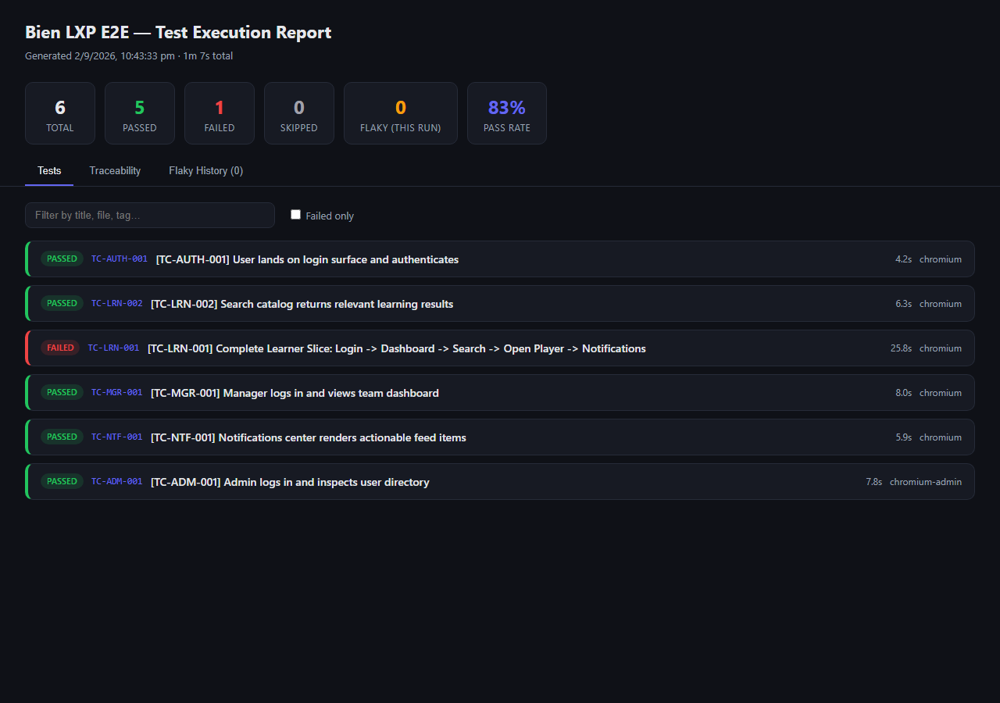
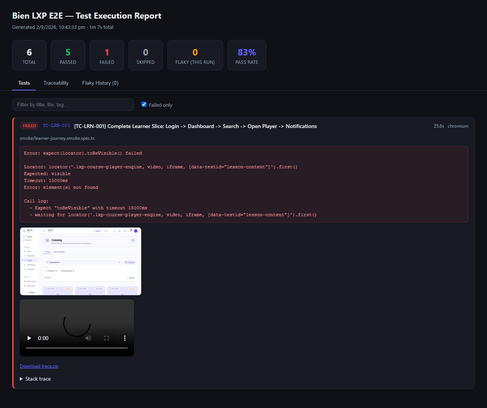
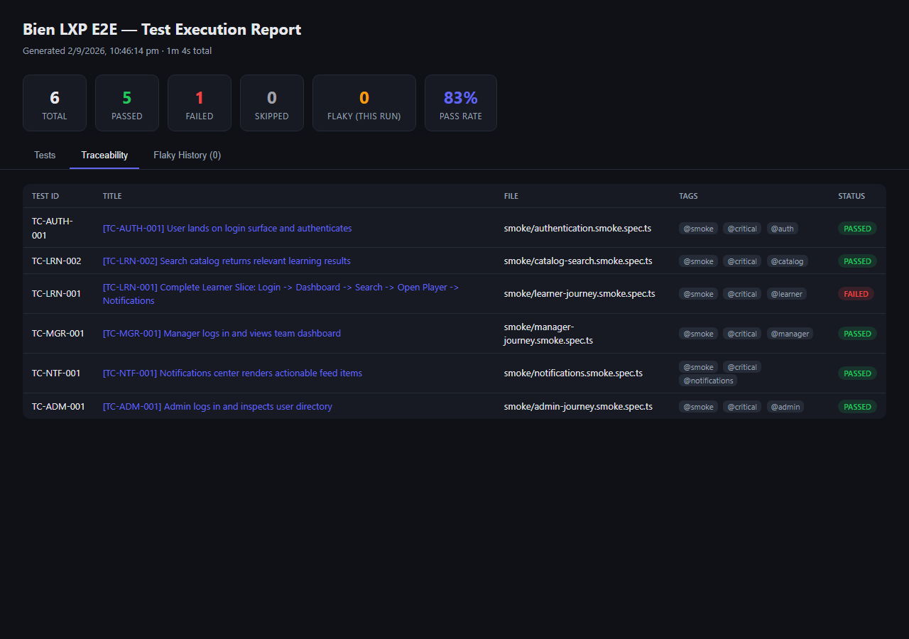

# @open-test/playwright-core

**Enterprise Playwright E2E, Data-Driven Testing (DDT), Performance & AI-Powered Testing Framework.**

A product-agnostic layer on top of [Playwright](https://playwright.dev) for teams who want more
than raw Playwright out of the box: a Page Object / Task / Factory architecture, CSV/Excel/JSON-
driven data-driven testing, Core Web Vitals & network performance budgets, axe-core accessibility
auditing, visual regression, HAR/PII-redacted failure forensics, optional AI-assisted failure
triage, and a BDD-style `Given`/`When`/`Then` wrapper that doubles as living documentation. MIT
licensed, zero paid tools, zero vendor lock-in.

This package has **no knowledge of any specific application** — it's the reusable engine. You
install it and build your own domain-specific test suite (page objects, tasks, mocks, specs) in
your own project, the same way you'd build on top of any other test framework.

## Requirements

- Node.js >= 20
- [pnpm](https://pnpm.io/), npm, or yarn
- A running instance of the application you're testing, reachable over HTTP

## Install

```bash
npm install --save-dev @open-test/playwright-core @playwright/test
# or: pnpm add -D @open-test/playwright-core @playwright/test
npx playwright install --with-deps
```

## Quickstart

A minimal page object + test, using `BasePage`:

```ts
// pages/LoginPage.ts
import { BasePage } from '@open-test/playwright-core';
import type { Page } from '@playwright/test';

export class LoginPage extends BasePage {
  constructor(page: Page) {
    super(page, '/login');
  }

  readonly emailInput = this.page.getByLabel(/email/i);
  readonly passwordInput = this.page.getByLabel(/password/i);
  readonly signInButton = this.page.getByRole('button', { name: /sign in/i });

  async login(email: string, password: string): Promise<void> {
    await this.fill(this.emailInput, email);
    await this.fill(this.passwordInput, password);
    await this.click(this.signInButton);
  }
}
```

```ts
// login.spec.ts
import { test, expect } from '@playwright/test';
import { LoginPage } from './pages/LoginPage';

test('user can log in', async ({ page }) => {
  const loginPage = new LoginPage(page);
  await loginPage.navigate();
  await loginPage.login('user@example.com', 'password123');
  await expect(page).toHaveURL(/dashboard/);
});
```

## AI-powered HTML report

Screenshots, videos, and traces sitting in separate `test-results/` folders don't help a
developer or a QA engineer understand *why* something broke — they have to hunt for the right
file, cross-reference it against a test ID, then read a raw stack trace themselves. `AiHtmlReporter`
assembles everything the framework already captures into one self-contained dashboard, and —
opt-in, using your own LLM API key — adds a root-cause summary and suggested fix per failure.



Click any test to expand it in place — real screenshot thumbnail, embedded video player, a
downloadable trace, and the full (ANSI-stripped, PII-redacted) error and stack trace:



A **Traceability** tab turns the `[TC-XXX-001]` convention already used throughout your specs
into a live matrix — test ID, title, source file, tags, and pass/fail status, all in one sortable
table (each row deep-links back to that test's card):



A third **Flaky History** tab shows tests that only passed after a retry, persisted across runs
(not just the current one) via `FlakyQuarantineManager`, with tests crossing a configurable
retry threshold flagged for quarantine.

### Wiring it in

```ts
// playwright.config.ts
export default defineConfig({
  reporter: [
    ['list'],
    ['html'],
    [
      '@open-test/playwright-core/dist/reporting/AiHtmlReporter.js',
      {
        outputDir: 'ai-html-report',
        projectTitle: 'My App — Test Execution Report',
        // Opt-in only — omit this line entirely and the report still generates in full
        // (thumbnails, video, traceability, flaky history), just without the AI panel. No
        // LLM call happens unless this is set.
        aiProvider: process.env.AI_REPORT_PROVIDER, // 'gemini' | 'openai' | 'claude' | 'ollama'
      },
    ],
  ],
});
```

If your bundler/runtime can't resolve a package subpath directly (this repo's own example suite
hits exactly that, since it consumes `core` via pnpm's `workspace:*` protocol against source, not
a built `dist/`), add one small local file instead and point the reporter array at that:

```ts
// reporters/aiHtmlReporter.ts
import { AiHtmlReporter } from '@open-test/playwright-core';
export default AiHtmlReporter;
```

```ts
// playwright.config.ts
reporter: [['list'], ['./reporters/aiHtmlReporter.ts', { aiProvider: process.env.AI_REPORT_PROVIDER }]]
```

### What "AI-powered" actually means here

- **Opt-in, never silent.** No API call happens unless `aiProvider` is explicitly set (or the
  `AI_REPORT_PROVIDER` env var is). A report with `aiProvider` unset is still the full dashboard
  above — traceability, thumbnails, video, flaky history — just without the AI panel.
- **Bring your own key.** `AiFailureAnalyzer` already supports Gemini, OpenAI, Claude, and a fully
  local Ollama provider (zero external calls, zero cost) — see [`ai-insights/`](./src/ai-insights).
  Configure whichever one your team already has access to via that provider's own env vars (see
  each provider file for its exact variable name).
- **Redacted before it leaves the process.** Console logs, error messages, and stack traces are
  passed through `PiiRedactor` before being sent to any provider — see
  [`forensics/PiiRedactor.ts`](./src/forensics/PiiRedactor.ts).
- **Never blocks or fails your suite.** If the analysis call errors (bad key, rate limit, network),
  the reporter catches it and shows "AI analysis unavailable" in that test's card — it never turns
  a real test failure into a reporter failure.
- **Per-failure structured output**, not a free-text chat response: a category (`[PRODUCT_BUG]`,
  `[LOCATOR_DRIFT]`, `[ENVIRONMENT_TIMEOUT]`, `[API_REGRESSION]`, `[TEST_DATA_MISMATCH]`, or
  `[UNKNOWN_FAILURE]`), a confidence percentage, a root-cause explanation, and — where the model
  can infer one — a suggested code fix. See [`ai-insights/types.ts`](./src/ai-insights/types.ts).

## Configuring your target application

This package doesn't ship a `playwright.config.ts` — that lives in your own project, same as
with vanilla Playwright:

```ts
// playwright.config.ts
import { defineConfig } from '@playwright/test';

export default defineConfig({
  use: {
    baseURL: process.env.BASE_URL ?? 'http://127.0.0.1:3000',
  },
  webServer: {
    command: 'pnpm dev',
    url: process.env.BASE_URL ?? 'http://127.0.0.1:3000',
    reuseExistingServer: !process.env.CI,
  },
});
```

Keep your app's own real defaults (base URL, API URL, persona credentials, etc.) in one small
config module rather than scattering `process.env.X ?? 'hardcoded-value'` across specs —
`ConfigLoader` (below) gives you an env-var-driven starting point.

## Building your own test suite on top

The intended pattern: `core` provides the primitives, your app's own package supplies the domain
knowledge — page objects extending `BasePage`, REST clients extending `BaseApiClient`, business
"tasks" extending `BaseTask`, and your own role-seed helper built on this package's generic
`SessionManager`/`AuthStorageSeed`.

### 1. Page objects

Extend `BasePage`. Locators as readonly fields, user-facing actions as async methods — keep raw
Playwright calls out of your spec files.

```ts
export class DashboardPage extends BasePage {
  constructor(page: Page) {
    super(page, '/dashboard');
  }
  readonly welcomeBanner = this.page.getByRole('heading', { name: /welcome/i });
}
```

### 2. Tasks (optional)

For a multi-step flow reused across many specs (e.g. "log in as role X and land on route Y"),
extend `BaseTask` and wire it into a Playwright fixture:

```ts
import { BaseTask } from '@open-test/playwright-core';

export interface LoginAsInput { role: 'admin' | 'user'; targetPath?: string }

export class LoginAsTask extends BaseTask<LoginAsInput, void> {
  async performAs({ role, targetPath }: LoginAsInput): Promise<void> {
    // seed a session (see "Seeding an authenticated session" below), then navigate
  }
}
```

```ts
// fixtures/myAppTest.ts
import { test as base } from '@playwright/test';
import { LoginAsTask } from '../tasks/LoginAsTask';

export const test = base.extend<{ loginAs: (role: 'admin' | 'user', path?: string) => Promise<void> }>({
  loginAs: async ({ page }, use) => {
    const task = new LoginAsTask(page);
    await use((role, targetPath) => task.performAs({ role, targetPath }));
  },
});
export { expect } from '@playwright/test';
```

### 3. Mocks (optional)

If you want deterministic tests independent of a live backend, install `page.route()`
interceptors in one place and call that from your fixtures — one function your whole suite reuses,
not ad-hoc mocking scattered across specs.

### 4. Spec files — BDD-style steps

Use `Given`/`When`/`Then`/`And` to structure the test as readable steps; these are also what the
living-documentation generator (below) parses into a spec catalog:

```ts
import { test, expect } from '../fixtures/myAppTest.js';
import { Given, When, Then } from '@open-test/playwright-core';

test.describe('Checkout @regression @cart', () => {
  test('[TC-CART-001] User can complete checkout with a saved card', async ({ page, loginAs }) => {
    await Given('a returning customer with items in their cart', async () => {
      await loginAs('user', '/cart');
    });

    await When('they submit checkout with their saved payment method', async () => {
      // ...
    });

    await Then('they land on the order confirmation page', async () => {
      await expect(page).toHaveURL(/order-confirmation/);
    });
  });
});
```

### 5. Tag your tests

Tags in the test title (e.g. `@smoke`, `@regression`, `@ddt`, `@perf`, `@accessibility`,
`@visual`) are just substrings `playwright test --grep` matches — invent whatever tag vocabulary
fits your project and wire matching `npm`/`pnpm` scripts to them (`"test:smoke": "playwright test
--grep @smoke"`, etc.).

## Data-driven tests (CSV / Excel / JSON)

```ts
import { test } from '../fixtures/myAppTest.js';
import { withData } from '@open-test/playwright-core';
import { z } from 'zod';
import path from 'node:path';

const RowSchema = z.object({ email: z.string(), role: z.string(), expectedAccess: z.string() });
type Row = z.infer<typeof RowSchema>;

withData<Row>(path.resolve(process.cwd(), 'data/users.csv'), {}, RowSchema).test(
  'Verify access for role',
  async ({ page, loginAs }, row) => {
    // one sub-test per row, run sequentially against the same page
  },
  test,
);
```

CSV, Excel (`.xlsx` — pass `{ sheetName }`), and JSON are all supported via the same `withData()`
API — see [`src/data-driven`](./src/data-driven).

## Performance budgets & accessibility

```ts
import { PerformanceBudgetGuard, CoreWebVitalsCollector } from '@open-test/playwright-core';

const metrics = await cwvCollector.collect();
PerformanceBudgetGuard.assertBudget('LCP', metrics.lcp, 3000);
```

```ts
import { A11yAuditor } from '@open-test/playwright-core';

const violations = await A11yAuditor.audit(page, { tags: ['wcag2a', 'wcag2aa'] });
expect(violations).toHaveLength(0);
```

## Seeding an authenticated session (skip the login UI)

The framework doesn't know your app's storage shape — you describe it once, it handles writing it
before the page's first script runs:

```ts
import { SessionManager, JwtHelper, type AuthStorageSeed } from '@open-test/playwright-core';

const token = JwtHelper.createSyntheticToken({ sub: 'user-1', email: 'user@example.com' });
const seed: AuthStorageSeed = {
  storageKeys: ['my-app-auth'], // whatever localStorage key(s) your app's client reads
  state: { token, isAuthenticated: true },
};
await SessionManager.seedSession(page, seed);
```

If a later test needs to simulate that session expiring/being cleared and reloading, use
`SessionManager.clearSession(page, storageKeys)` rather than a plain `localStorage.removeItem()`
— `seedSession()`'s write happens via a permanent `page.addInitScript()` that Playwright has no
API to unregister, so a bare removal gets silently re-written on the very next reload.
`clearSession()` handles this correctly — see
[`src/auth/StorageStateProvider.ts`](./src/auth/StorageStateProvider.ts).

## Generating living documentation

The BDD parser can turn your `Given`/`When`/`Then` specs into a Markdown spec catalog — useful as
executable, always-up-to-date documentation for stakeholders who don't read code:

```bash
npx tsx node_modules/@open-test/playwright-core/src/bdd-living-docs/cli.ts <specDir> <outputPath> --title="My Project"
```

Or, if you've cloned this repo directly to work on the framework itself:

```bash
pnpm generate:living-docs
```

## What's in here

| Module | What it does |
|---|---|
| `base/` | `BasePage`, `BaseComponent`, `BaseTask`, `BaseApiClient`, `BaseFactory` — the abstract classes everything else builds on |
| `auth/` | Generic session seeding (`SessionManager`, `StorageStateProvider`, `JwtHelper`) — no product-specific storage keys or state shape |
| `config/` | `ConfigLoader`/`EnvConfig` — env-var-driven configuration with generic defaults |
| `data-driven/` | CSV/Excel/JSON data providers + `zod`-validated `withData()` test wrapper |
| `forensics/` | `HarRecorder`, `DiagnosticBundle`, `TelemetryCollector`, `PiiRedactor` — failure artifact capture with PII redaction before anything leaves the machine |
| `ai-insights/` | Pluggable AI root-cause analysis (`AiFailureAnalyzer`) with Gemini/OpenAI/Claude/local-Ollama provider adapters |
| `bdd-living-docs/` | `Given`/`When`/`Then` wrappers + a CLI that generates a living Markdown spec catalog from your specs |
| `performance/` | Core Web Vitals collection, network timing, a performance-budget guard, and a k6 load-script generator |
| `accessibility/` | Axe-core-powered WCAG 2.1 AA auditor |
| `visual/` | Masked visual-regression snapshot matching |
| `reporting/` | `AiHtmlReporter` — the comprehensive HTML dashboard described above; structured logging; persistent flaky-test tracking (`FlakyQuarantineManager`); Slack/Teams webhook notifications |

## Working on the framework itself

```bash
git clone https://github.com/techwitz/e2e-framework.git
cd e2e-framework
pnpm install
pnpm typecheck
```

## Contributing

See [CONTRIBUTING.md](./CONTRIBUTING.md) — the no-product-coupling rule plus the self-check
command.

## License

MIT — see [LICENSE](./LICENSE).
